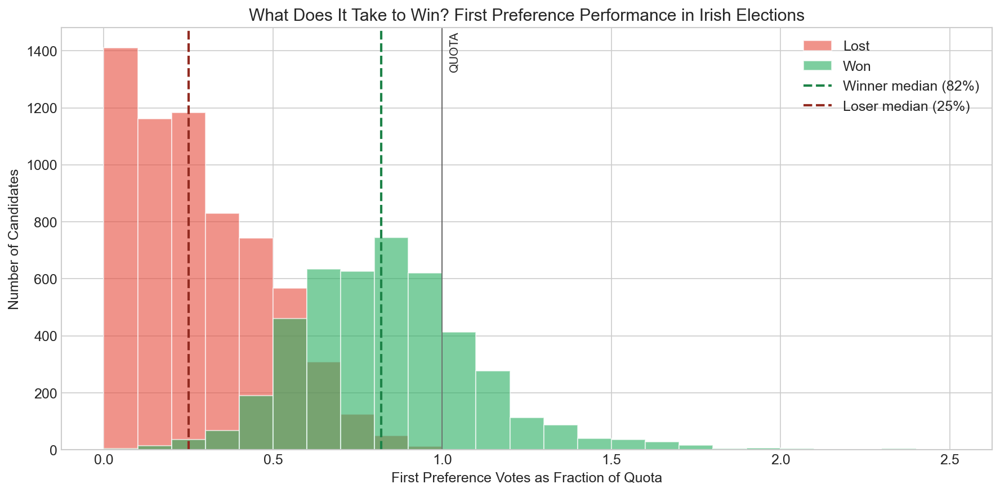
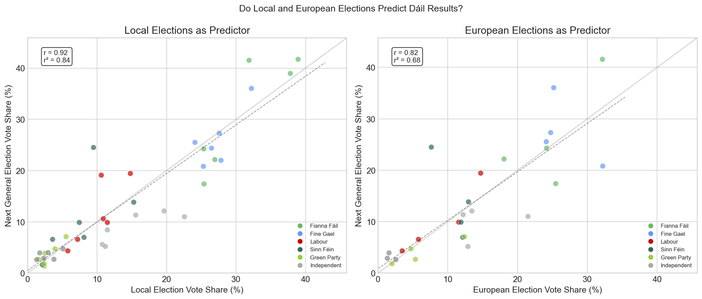
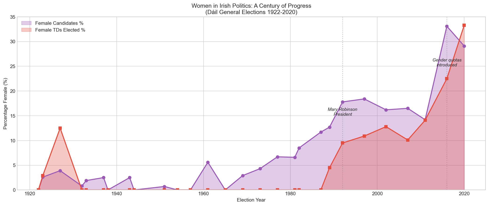

# What 100 Years of Irish Elections Tell Us About Winning

*A data-driven dive into 36,000 candidate records reveals the mathematics of victory in Ireland's unique electoral system*

---

Ireland uses one of the most complex voting systems in the world: Single Transferable Vote (STV) with multi-seat constituencies. Voters rank candidates by preference, and votes are transferred when candidates are elected or eliminated until all seats are filled.

But what does it actually take to win under this system?

I analyzed over 36,000 candidate records spanning 100 years of Irish elections (1920-2020) to find out. The results reveal surprising patterns about party efficiency, the rise and fall of independents, and just how far STV's transfer system can stretch.

## The Magic Number: 82% of Quota



Under STV, each constituency has a **quota** — the minimum number of votes needed to guarantee election. It's calculated as:

```
Quota = (Total Valid Votes / (Seats + 1)) + 1
```

**Key Finding**: Winning candidates typically receive **82% of the quota** on first preference votes alone. Losers average just **25%**.

This gap — 57 percentage points — is the difference between victory and defeat in Irish politics. While STV allows for vote transfers from eliminated candidates, the data shows that first preferences remain the dominant factor.

| Metric | Winners | Losers |
|--------|---------|--------|
| Mean quota ratio | 84.5% | 28.2% |
| Median quota ratio | 82% | 25% |
| Standard deviation | 32.5% | 22.5% |

## The Extremes of STV: Winning Without Votes

STV can produce outcomes that look impossible at first glance. The most striking examples are candidates who won their seats with almost no first-preference votes — carried entirely by transfers from other candidates.

| Year | Candidate | Constituency | Quota Ratio | How They Won |
|------|-----------|--------------|-------------|--------------|
| 1923 | Brian O'Higgins | Clare | **2%** | Éamon de Valera's massive surplus |
| 2007 | Cyprian Brady | Dublin Central | **14%** | Bertie Ahern's surplus transfers |
| 1982 | Denis Foley | Kerry North | **15%** | Late transfers from eliminated candidates |

Brian O'Higgins won his seat with just **2% of the quota** on first preferences — around 500 votes in a constituency where the quota was over 10,000. He was carried by transfers from Éamon de Valera, who had a huge personal vote. It remains one of the most extreme examples of STV's transfer mechanism in action.

Cyprian Brady's 2007 win was controversial. He was Bertie Ahern's running mate in Dublin Central, and Ahern's office sent a letter to 30,000 constituents asking for second preferences for Brady. With only 939 first-preference votes, Brady was elected on Ahern's surplus. It showed both the power and the limits of vote management — Brady lost his seat at the next election when Ahern was no longer on the ballot.

These cases highlight something fundamental about STV: first preferences dominate, but in the right circumstances, a well-placed candidate can ride someone else's coattails all the way to the Dáil.

## The Rise of Sinn Féin: From 0% to 88%


One of the most dramatic stories in the data is Sinn Féin's electoral trajectory.

In the 1960s, Sinn Féin candidates won **0%** of their races. Throughout the 1980s: still 0%. Even by 1997, they had won just **one** Dáil seat.

Then came 2020.

| Decade | Wins | Win Rate |
|--------|------|----------|
| 1960s | 0 | 0% |
| 1980s | 0 | 0% |
| 1990s | 1 | 1.8% |
| 2000s | 9 | 11.5% |
| 2010s | 37 | 40.7% |
| 2020 | 37 | **88.1%** |

In 2020, Sinn Féin ran 42 candidates and **37 won** — an efficiency rate of 88.1%. This wasn't just a good result; it was the most efficient major party campaign in modern Irish electoral history.

The lesson? Sinn Féin ran exactly as many candidates as they could realistically win. This strategic discipline is rare in Irish politics, where parties often "spread the vote" across multiple candidates.

## Where Did the Left-Wing Vote Go?


Sinn Féin's rise didn't happen in a vacuum. There's a persistent pool of left-wing voters in Ireland, and the data shows it moving between parties like water finding its level.

| Year | Labour | Sinn Féin | Left Total |
|------|--------|-----------|------------|
| 2002 | 10.7% | 6.6% | 18.5% |
| 2007 | 9.9% | 7.0% | 18.2% |
| 2011 | **19.4%** | 9.9% | 31.7% |
| 2016 | 6.6% | **13.9%** | 27.6% |
| 2020 | 4.4% | **24.5%** | 34.5% |

In 2011, Labour ran on a moderately anti-austerity platform and surged to 19.4% — their best ever result. They then entered coalition with Fine Gael and implemented the very austerity programme they'd campaigned against. The punishment was swift: by 2016, Labour collapsed to 6.6%, losing two-thirds of their voters in a single election.


Sinn Féin absorbed much of that vote, but not all of it. The total left-wing pool actually grew from 18% to 35% over this period, suggesting that austerity politics activated voters who hadn't previously supported any left party. People Before Profit and the Social Democrats also emerged as smaller beneficiaries.

The question now is whether Sinn Féin can hold this coalition together. Their base is a mix of left-wing economic voters and republican nationalists — two groups that don't always want the same things. If Sinn Féin enters government and disappoints (as Labour did), will voters fragment across the Social Democrats, PBP, and independents? Or will the cycle repeat with yet another party absorbing the left?

## Do Local Elections Predict the Dáil?



Ireland holds local and European elections between general elections. A natural question: do these results predict what happens next at the Dáil level?

I compared party vote shares in every local and European election since 1991 with the subsequent general election. The answer is **yes, mostly** — with one enormous exception.

**Local elections** are a strong predictor of general election performance, with an r² of 0.84. If a party gets 25% in the locals, they'll probably get somewhere near 25% in the next general election. Fine Gael and Fianna Fáil in particular tend to track closely between local and general elections.

**European elections** are weaker predictors (r² = 0.68), partly because turnout is lower and smaller parties can overperform.

But the model completely failed in one case: **Sinn Féin 2020**. In the 2019 local elections, Sinn Féin got 9.5% of the vote. In the 2019 European elections, they got 7.6%. Eight months later, they got **24.5%** in the general election — a 15-point surge that no prior election predicted.

| Election | SF Vote Share |
|----------|--------------|
| Local 2019 | 9.5% |
| European 2019 | 7.6% |
| **General 2020** | **24.5%** |

What happened? Sinn Féin deliberately ran fewer candidates in local elections (conserving resources) and benefited from a late swing during the general election campaign, driven by housing and health issues that crystallised in the final weeks. It's a reminder that local elections measure the political landscape as it is, not as it's about to become.

## The Fianna Fáil Century


Fianna Fáil has dominated Irish politics like no other party:

| Party | Total Seats Won | Win Rate |
|-------|-----------------|----------|
| Fianna Fáil | 1,892 | 61.8% |
| Fine Gael | 1,161 | 50.2% |
| Labour | 472 | 37.2% |
| Sinn Féin | 93 | 22.0% |
| Independent | 215 | 12.3% |

Fianna Fáil's 61.8% win rate means that nearly two-thirds of their candidates won — the highest efficiency among major parties. They've held government for most of Ireland's history, and the data shows why: consistent performance across decades and regions.

But look at the 2010s and 2020. For the first time, Fianna Fáil's dominance cracked. Fine Gael surpassed them in the 2010s, and in 2020, Sinn Féin matched them seat-for-seat.

## The Death and Resurrection of Independents


Independents — candidates without party affiliation — have had a wild ride:

| Decade | Win Rate |
|--------|----------|
| 1920s | 20.0% |
| 1930s | 32.6% |
| 1950s | 38.3% |
| 1970s | **4.8%** |
| 1980s | **3.1%** |
| 2020 | 15.1% |

In the 1980s, running as an independent was nearly hopeless — a 3.1% success rate. But something changed. By 2020, independents were winning 15% of their races and holding 19 Dáil seats.

Why the resurgence? Several factors:

1. **Voter disillusionment** with established parties after the financial crisis
2. **High-profile independents** like Shane Ross building personal brands
3. **The Independent Alliance** providing some organizational support
4. **Social media** allowing candidates to build followings without party infrastructure

## Women in Irish Politics: The Surprising Win Rate



Here's a statistic that surprised me: **women have a higher win rate than men**.

| Gender | Win Rate |
|--------|----------|
| Female | **14.7%** |
| Male | 12.6% |

Out of 4,811 Dáil candidates in my dataset, only 484 (10.1%) were women. But those women won 14.7% of the time, compared to 12.6% for men.

Why? 

My hypothesis is that parties tend to run women only when they have a strong chance of winning — selection bias rather than a gender advantage. When parties do nominate women, those candidates tend to be well-known locally and well-resourced.

The progress has been slow but steady:

| Era | Female Candidates | Female TDs |
|-----|------------------|------------|
| 1920s-1950s | ~2% | ~1% |
| 1960s-1980s | ~5% | ~3% |
| 1990s-2000s | ~12% | ~10% |
| 2010s-2020 | ~22% | ~23% |

In 2012, Ireland legislated **gender quotas** requiring parties to field at least 30% female candidates or lose half their state funding. The requirement took effect for the 2016 election and rose to 40% from 2023 onwards. The impact was immediate — and our data captures this inflection point.

**Pioneering Women:**
- **Constance Markievicz** (1918/1919) — First woman elected to Westminster (1918), first woman in the Dáil (1919)
- **Mary MacSwiney** (1921) — Elected to the Second Dáil for Cork
- **Margaret Collins O'Driscoll** (1923) — Sister of Michael Collins, elected for Dublin North
- **Mary Harney** (1981) — Later became first female Tánaiste
- **Mary Robinson** (1990) — Though for President, not Dáil, her election shifted perceptions

**Most Elected Women (Dáil General Elections):**
| Name | Times Elected | Years Active | Notes |
|------|--------------|--------------|-------|
| Mary Harney | 9 | 1981-2007 | FF then PDs; Dublin SW then Dublin MW |
| Róisín Shortall | 7 | 1992-2020 | Labour then Social Democrats |
| Eileen Desmond | 5 | 1965-1982 | Labour; Cork Mid then Cork SC |
| Liz McManus | 4 | 1992-2007 | Workers' Party, Dem Left, then Labour |

*Note: Candidates who changed party or constituency across elections can be undercounted if tracked by name+party alone — a recurring data quality challenge with this dataset.*

## The Geography of Power

Different parties dominate different regions:

| Region | Top Party | Seats Won |
|--------|-----------|-----------|
| Dublin | Fianna Fáil | 355 |
| Cork | Fianna Fáil | 215 |
| Galway | Fianna Fáil | 123 |
| Connacht | Fianna Fáil | 205 |
| Ulster (ROI) | Fianna Fáil | 158 |

Fianna Fáil's dominance is remarkably consistent across regions. But dig deeper and patterns emerge:

- **Labour** performs best in Cork (74 seats) and Dublin (122 seats) — urban strongholds
- **Independents** do better in **Ulster** (30 seats) than anywhere else — reflecting the fragmented politics of the border region
- **Fine Gael** is relatively strongest in Leinster outside Dublin

## Elections Are Getting More Crowded


In 1938, there were **1.65 candidates per seat**. By 2016, it was **3.5 candidates per seat**.

Elections are getting more competitive. More candidates means:
- More choices for voters
- More transfer votes changing hands
- More unpredictable outcomes
- More expensive campaigns

## What This Means for Candidates

If you're thinking of running for the Dáil, here's what the data says:

1. **You need first preferences.** Transfers help, but 82% of winners get there on first preferences alone.

2. **Party matters enormously.** Independents have a 12.3% win rate; Fianna Fáil has 61.8%. That's a 5x difference in your odds.

3. **Geography matters.** Running in Tipperary South (most competitive) is very different from Donegal East (historically easier).

4. **Timing matters.** The 2011 election was a "change election" — normal patterns broke down. The 2020 election saw Sinn Féin's surge. Running in the right year can make all the difference.

5. **Be strategic about running mates.** Parties that spread votes too thin among candidates hurt everyone's chances.

---

## Methodology

**Data Sources:**
- ElectionsIreland.org (30,070 records)
- IrelandElection.com (36,243 records)

**Election Types Analyzed:**
- Dáil General Elections (primary focus)
- By-Elections
- Local Elections
- European Elections

**Time Period:** 1920-2020

**Key Metrics:**
- Quota Ratio = First Preference Votes / Quota
- Win Rate = Seats Won / Candidates Run

**Code:** Available on [GitHub](https://github.com/fingers53/irish-elections-analysis)
